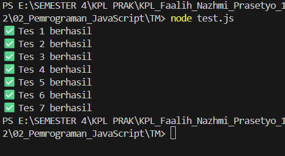

Soal

Buatlah sebuah fungsi bernama fizzBuzz yang menerima input larik (array) dan mengembalikan deretan bilangan dan "Fizz" untuk kelipatan 2, "Buzz" untuk kelipatan 7, dan "FizzBuzz" untuk kelipatan 14. Beri nama berkas program sebagai tm.js dan taruh di direktori TM.

Output

Deskrpsi  program
Fungsi fizzBuzz diawali dengan menerima sebuah parameter berupa array yang kemudian diperiksa menggunakan Array.isArray() untuk memastikan bahwa input yang diberikan memiliki tipe data yang sesuai. Jika hasil validasi menunjukkan bahwa input bukan array, fungsi akan langsung menghentikan eksekusi dan mengembalikan pesan error yang telah ditentukan.

Setelah input dinyatakan valid, fungsi membuat sebuah array kosong bernama result yang digunakan untuk menyimpan hasil pengolahan setiap elemen. Selanjutnya, fungsi melakukan iterasi menggunakan perulangan for dan memanfaatkan operator modulus (%) untuk memeriksa apakah suatu angka merupakan kelipatan 14, 7, atau 2. Berdasarkan hasil pengecekan tersebut, elemen akan dikonversi menjadi teks "FizzBuzz", "Buzz", atau "Fizz". Sementara itu, angka yang tidak memenuhi salah satu kondisi tersebut akan diubah menjadi string menggunakan metode .toString().

Setelah seluruh elemen selesai diproses, fungsi menentukan format penggabungan hasil dengan memanfaatkan metode includes(). Jika array input mengandung nilai 1 atau -1, seluruh elemen dalam result akan digabung menggunakan pemisah koma dan spasi (", "). Sebaliknya, jika kedua nilai tersebut tidak ditemukan, elemen-elemen akan digabung menggunakan spasi biasa (" "). Hasil penggabungan tersebut kemudian dikembalikan sebagai nilai akhir fungsi dan diekspor menggunakan module.exports agar dapat digunakan oleh modul lain.