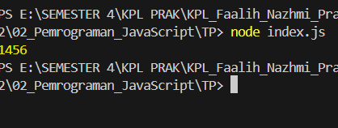

# Tugas Pendahuluan 02: Pemrograman JavaScript
**Soal**

Kamu sudah menulis fungsi mulOfArray. Ujilah dengan input [2, 0, 26, 28, -2], dengan output yang seharusnya adalah 1456. Jika kamu menemukan bahwa hasilnya berbeda, bisakah kamu memperbaikinya? Jika kamu menemukan bahwa hasilnya sama, bisakah kamu menjelaskan mengapa demikian?

**Output**

**Deskripsi Program**
Hasil eksekusi program tetap menghasilkan nilai yang sama karena fungsi mulOfArray() hanya melakukan perkalian terhadap elemen array yang bernilai lebih besar dari nol. Hal ini ditentukan oleh kondisi if (arr[i] > 0), sehingga nilai 0 dan -2 yang terdapat pada array tidak ikut diproses dalam operasi perkalian.

Pada array [2, 0, 26, 28, -2], hanya angka 2, 26, dan 28 yang memenuhi syarat untuk dikalikan. Variabel result diawali dengan nilai 1, kemudian dikalikan secara bertahap dengan ketiga angka positif tersebut hingga menghasilkan nilai akhir 1456. Karena nilai 0 dan -2 diabaikan oleh kondisi if, keduanya tidak memengaruhi hasil perhitungan.

Apabila kondisi if (arr[i] > 0) dihapus, maka seluruh elemen array akan ikut dikalikan. Dalam kasus tersebut, keberadaan angka 0 akan menyebabkan hasil perkalian menjadi 0, karena berapapun nilainya jika dikalikan dengan nol akan menghasilkan nol. Oleh karena itu, hasil program tetap sama selama kondisi tersebut tetap digunakan dan hanya bilangan positif yang diproses.