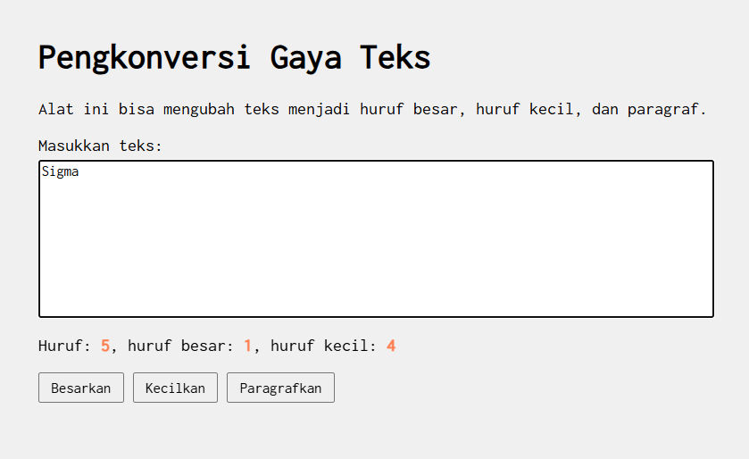

Untuk membuat tampilan website berada di tengah layar seperti pada kode di modul, digunakan properti margin dan max-width pada bagian body di CSS. Properti max-width berfungsi untuk membatasi lebar maksimum dari halaman website sehingga tampilan tidak melebar mengikuti ukuran layar yang besar. Dengan adanya batas lebar ini, konten halaman akan terlihat lebih rapi dan nyaman dibaca. Sementara itu, properti margin: 0 auto digunakan untuk mengatur jarak luar elemen agar browser secara otomatis memberikan ruang yang sama di sisi kiri dan kanan halaman. Dengan cara ini, konten halaman akan berada tepat di tengah layar secara horizontal. Kombinasi antara max-width yang membatasi lebar halaman dan margin auto yang menyeimbangkan jarak kiri dan kanan membuat tampilan website menjadi terpusat di tengah layar dan terlihat lebih terstruktur.