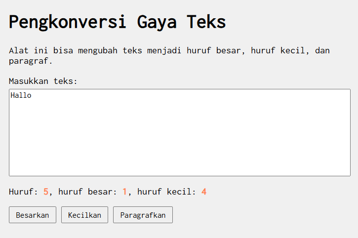
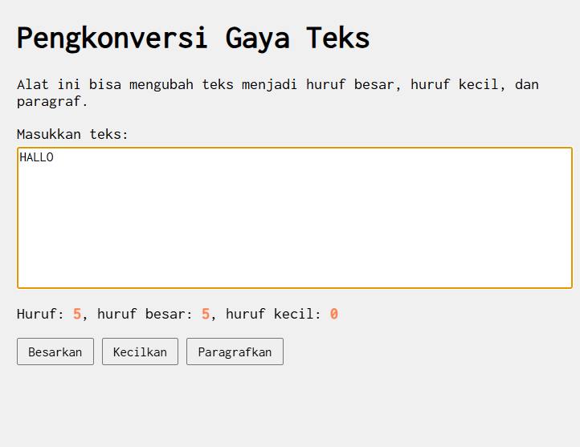
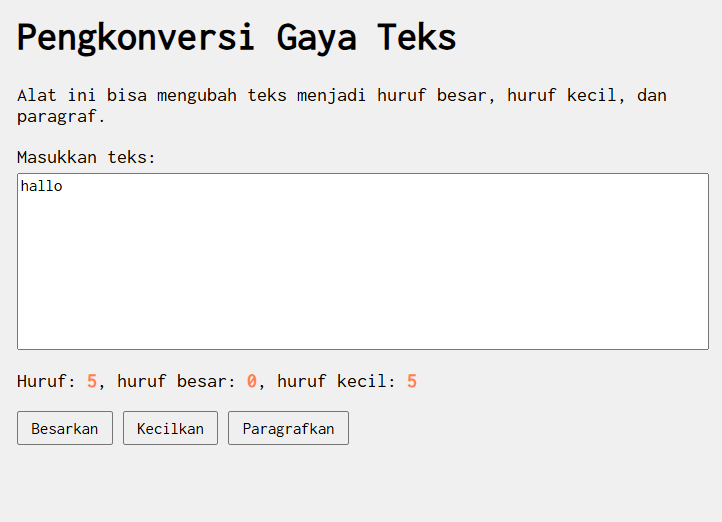
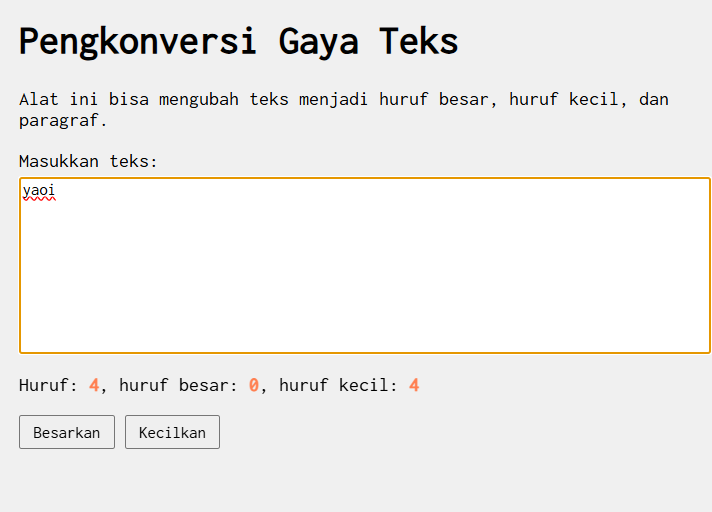

Nama: Faalih Nazhmi Prasetyo

NIM: 103122400065

Kelas: SE-08-02

Setelah kamu menyelesaikan tugas pendahuluan (bisa buka di atas), terapkanlah fungsi untuk 
(1) menghitung huruf kecil yang disediakan di #hk, 
(2) mengubah huruf kecil ke huruf besar ketika pengguna menekan tombol #huruf-besar
(3) mengubah huruf besar ke huruf kecil ketika pengguna menekan tombol #huruf-kecil.

Untuk nomor 2 dan 3, tampilkan hasilnya di dalam editor-kecil.

Kemudian, hapuslah fitur "Paragrafkan" dari alat.

## Soal 1
(1) menghitung huruf kecil yang disediakan di #hk,
    

## Soal 2
(2) mengubah huruf kecil ke huruf besar ketika pengguna menekan tombol #huruf-besar,
    

## Soal 3
(3) mengubah huruf besar ke huruf kecil ketika pengguna menekan tombol #huruf-kecil.
    

## Kemudian, hapuslah fitur "Paragrafkan" dari alat.
