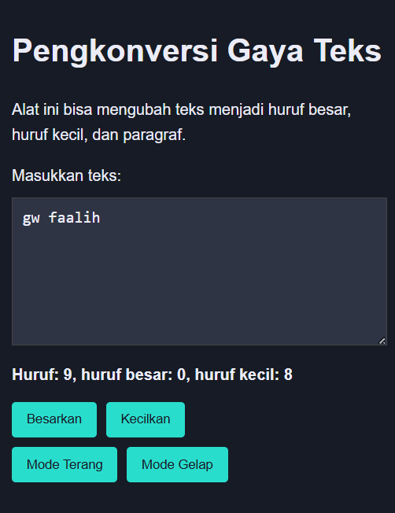

## Soal

Tambahkan mode gelap sekaligus untuk editor-kecil dan tombol-tombolnya. Ketentuan warna untuk latar belakang editor-kecil adalah #2e3443, sementara untuk tombol adalah #29ddcc. Teks untuk tombol tetap mengikuti warna teks sebelumnya.

Untuk menghapus pinggiran tombol, nyatakan properti border untuk tidak ditunjukkan.

## Deskripsi
 Disini saya juga menambahkan code untuk fitur menghitung huruf, membesarkan dan mengecilkan huruf

 ## Sebelum


## Setelah



Untuk mengimplementasikan mode gelap (dark mode), dilakukan penyesuaian pada skema warna antarmuka. Warna latar belakang editor berukuran kecil diatur menjadi #2e3443 guna memberikan tampilan yang lebih nyaman pada kondisi minim cahaya. Sementara itu, warna tombol diubah menjadi #29ddcc agar tetap terlihat menonjol dan mudah dikenali oleh pengguna. Adapun warna teks pada tombol tidak mengalami perubahan dan tetap menggunakan warna yang telah diterapkan sebelumnya, sehingga konsistensi tampilan antarmuka tetap terjaga.

```
.mode-gelap #editor-kecil {
    background-color: #2e3443;
    color: #ebecf7; 
    border: 1px solid #444; 
}
```

untuk tombol & hapus bordernya dengan warna #29ddcc.

```
.mode-gelap button {
    background-color: #29ddcc;
    color: #2e3443;
    border: none; 
}
```
