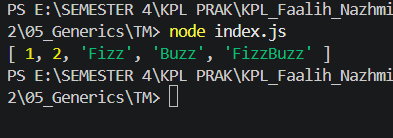

# Tugas Mandiri 05: Generics
Nama: Faalih Nazhmi Prasetyo
NIM: 103122400065
Kelas: SE0802

Aturan FizzBuzz pada soal ini adalah bahwa fungsi fizzBuzz hanya menerima sebuah array yang seluruh elemennya berupa bilangan bulat, lalu mengembalikan array yang elemennya dapat berupa campuran antara string dan angka. Selain itu, terdapat fungsi zzzzOrNum yang hanya menerima satu nilai berupa bilangan bulat dan akan mengembalikan salah satu dari "Fizz", "Buzz", "FizzBuzz", atau angka itu sendiri sesuai dengan logika yang berlaku. Kedua fungsi tersebut wajib dibuat serta harus dilengkapi dengan dokumentasi JSDoc yang sesuai dengan tipe data dan perilaku yang diharapkan, dan dalam implementasinya fungsi fizzBuzz harus menggunakan atau memanggil fungsi zzzzOrNum.

## Program/Kode
Tersedia di 
[index.js](index.js)

**Output**

Hasil [1, 2, 'Fizz', 'Buzz', 'FizzBuzz'] menunjukkan bahwa logika yang dibuat sudah benar, di mana angka 1 dan 2 tetap berupa angka karena bukan kelipatan 3 maupun 5, angka 3 menghasilkan "Fizz" karena merupakan kelipatan 3, angka 5 menghasilkan "Buzz" karena merupakan kelipatan 5, dan angka 15 menghasilkan "FizzBuzz" karena merupakan kelipatan 3 sekaligus 5. Pertama, dibuat fungsi bernama zzzzOrNum pada file JavaScript yang berfungsi untuk mengevaluasi satu angka. Jika angka habis dibagi 3 dan 5 maka akan mengembalikan "FizzBuzz", jika hanya habis dibagi 3 akan mengembalikan "Fizz", jika hanya habis dibagi 5 akan mengembalikan "Buzz", dan jika tidak memenuhi keduanya maka akan mengembalikan angka tersebut. Selanjutnya, dibuat fungsi fizzBuzz yang digunakan untuk memproses sekumpulan data berupa array bilangan bulat. Fungsi ini memanfaatkan metode .map() untuk menerapkan fungsi zzzzOrNum pada setiap elemen dalam array secara otomatis, sehingga menghasilkan array baru dengan nilai yang sudah ditransformasikan. Kemudian, kedua fungsi tersebut diekspor menggunakan module.exports agar dapat digunakan atau diuji pada file lain seperti test.js. Terakhir, fungsi dapat dipanggil dengan memberikan input berupa array, misalnya [1, 2, 3, 5, 15], dan hasilnya akan ditampilkan di console, menunjukkan bahwa angka 3 berubah menjadi "Fizz", angka 5 menjadi "Buzz", angka 15 menjadi "FizzBuzz", sementara angka lainnya tetap tidak berubah.