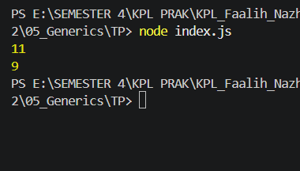

# Tugas Pendahuluan 05: Generics

**Nama:** Faalih Nazhmi Prasetyo
**NIM:** 103122400065
**Kelas:** SE-08-02
**Soal**

Bagaimana caramu hanya dengan satu fungsi generik bisa mengurus keduanya?

Agar fungsi yang kamu kerjakan benar atau tidak, berikut ini adalah kode tes yang bisa kamu tempelkan:

**Output**


```
function hitung(teks, mode) {
    let jumlah = 0;

    for (const c of teks) {
        if (mode === "huruf" && c === ' ') {
            continue;
        }
```

Jika mode bernilai "huruf" dan karakter yang sedang diperiksa adalah spasi, maka karakter tersebut akan dilewati dan program lanjut ke karakter berikutnya.

Karakter hanya akan diproses lebih lanjut jika tidak terkena kondisi continue.

```
        jumlah++;
    }
```
Setiap karakter yang tidak dilewati akan menambah nilai variabel jumlah sebanyak 1.
```
    return jumlah;
}
```
Setelah seluruh karakter selesai diproses, fungsi akan mengembalikan total jumlah karakter yang sudah dihitung.

**Pengujian**
```
const str = "Bar bar bar";
```
Digunakan sebagai data uji berupa string yang mengandung huruf dan spasi.

Menghitung semua karakter termasuk spasi (Hasil: 11)
```
console.log(hitung(str, "semua"));
```
Menghitung hanya karakter huruf tanpa spasi (Hasil: 9)
```
console.log(hitung(str, "huruf"));
```
Memanggil fungsi tanpa menampilkan hasil ke console, sehingga tidak ada output yang terlihat
```
hitung(str, "huruf");
```
