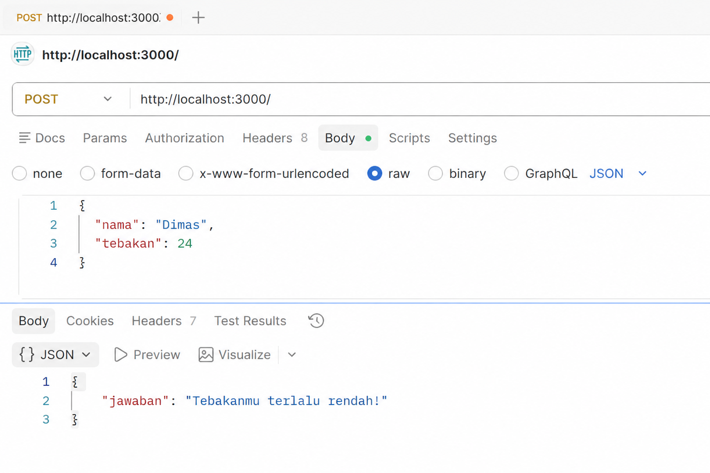

**Nama:** Faalih Nazhmi Prasetyo

**NIM:** 103122400065

**Kelas:** SE-08-02

## Soal
Mari kita main tebak-tebakan angka acak!

Tugasmu adalah membuat API yang terdiri dari satu endpoint saja, yaitu POST /. 

## Output

## Deskripsi
Objek Intl.DateTimeFormat dengan pengaturan lokal 'id-ID' dimanfaatkan untuk mengubah objek tanggal (Date) ke format penanggalan Indonesia secara otomatis. Dengan menetapkan properti seperti weekday, day, month, dan year ke nilai 'long' atau 'numeric', JavaScript dapat menghasilkan tampilan tanggal lengkap yang mencakup nama hari serta bulan tanpa perlu membuat konversi string secara manual. Pendekatan ini sangat efektif karena mampu menjaga keseragaman format tanggal di berbagai lingkungan runtime, sekaligus menyesuaikan aturan format dan tata bahasa sesuai standar lokal secara otomatis.