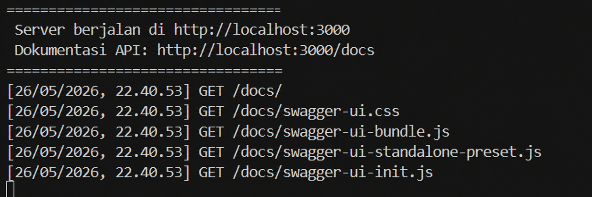
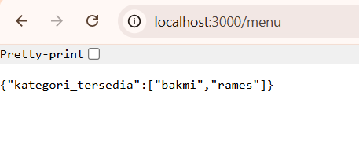
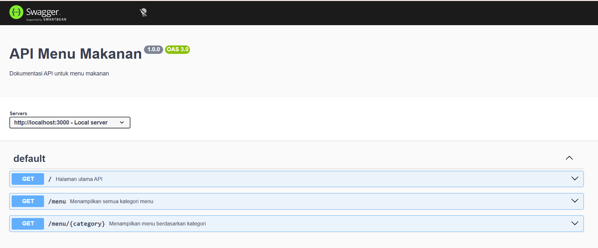
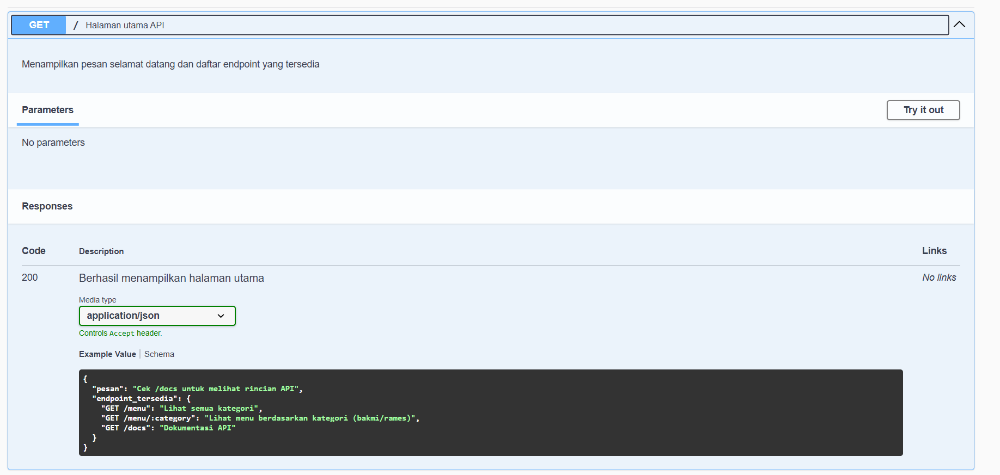
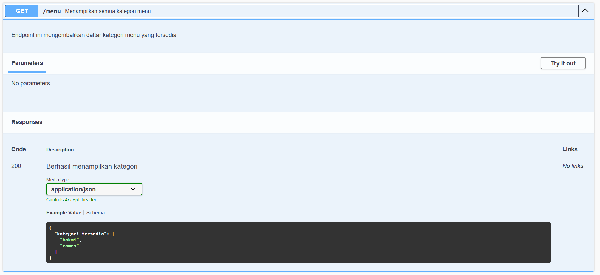
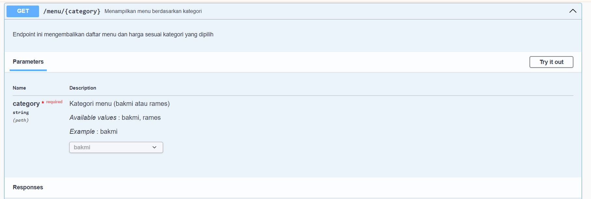
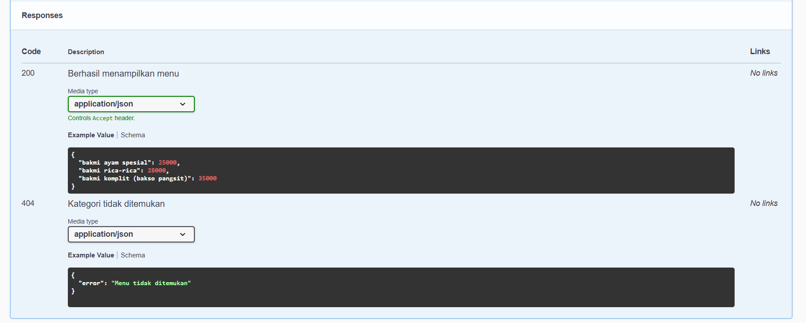

**Nama:** Faalih Nazhmi Prasetyo

**NIM:** 103122400065

**Kelas:** SE-08-02

## Soal
Buatlah satu endpoint lagi beserta dokumentasi OpenAPI-nya, yaitu GET /menu yang menampilkan daftar semua nama kategori menu yang ada.


## Output









## Deskripsi

API (Application Programming Interface) merupakan sebuah antarmuka yang memungkinkan dua perangkat lunak untuk saling berkomunikasi dan bertukar data tanpa harus terhubung secara langsung satu sama lain. Konsep API bersifat luas dan tidak hanya terbatas pada REST API yang umum digunakan untuk pertukaran data berbasis JSON, tetapi juga mencakup bentuk lain seperti Windows API yang dimanfaatkan aplikasi untuk berinteraksi dengan sistem operasi Windows.

REST sendiri merupakan salah satu arsitektur API yang menggunakan metode HTTP seperti GET, POST, PUT, dan DELETE, serta menerapkan prinsip stateless, yaitu setiap permintaan dari klien diproses secara mandiri tanpa menyimpan informasi sesi dari request sebelumnya.

Middleware pada Express.js
```
// Middleware logging
app.use((req, res, next) => {
    console.log(`${req.method} ${req.url}`);
    next(); // wajib dipanggil untuk lanjut ke endpoint
});

// Middleware parsing JSON
app.use(express.json());
```
 Middleware adalah fungsi perantara yang dijalankan setelah request diterima server dan sebelum response dikirimkan kembali ke klien. Mekanismenya berlangsung secara berurutan, di mana request akan melewati setiap middleware yang telah didaftarkan terlebih dahulu sebelum mencapai endpoint tujuan, kemudian barulah server mengirimkan response sesuai hasil proses tersebut.


```
p1
const swaggerDocument = {
    openapi: '3.0.0',
    paths: { ... }
};

p2
/**
 * @openapi
 * /menu:
 *   get:
 *     summary: Menampilkan semua menu
 */
```
Swagger digunakan sebagai alat untuk membuat dokumentasi API yang interaktif dan dapat dihasilkan secara otomatis. Terdapat dua pendekatan yang dapat diterapkan. Pendekatan pertama dilakukan secara manual, yaitu dengan mendefinisikan objek dokumentasi yang berisi seluruh spesifikasi endpoint, parameter, dan response secara eksplisit. Pendekatan kedua dilakukan secara otomatis dengan menambahkan komentar khusus pada endpoint, yang kemudian diproses oleh Swagger untuk menghasilkan dokumentasi secara otomatis.

Hasil Implementasi
```
// GET /menu
{
    "kategori_tersedia": ["bakmi", "rames"]
}

// GET /menu/bakmi
{
    "bakmi ayam spesial": 25000,
    "bakmi rica-rica": 28000
}
```

Pada tugas ini, dikembangkan sebuah API sederhana yang digunakan untuk mengelola data menu makanan. API tersebut memiliki tiga endpoint utama. Endpoint pertama adalah root endpoint yang menampilkan pesan sambutan beserta daftar endpoint yang tersedia. Endpoint kedua berfungsi untuk menampilkan seluruh kategori menu yang tersedia, seperti bakmi dan rames. Endpoint ketiga digunakan untuk menampilkan daftar menu lengkap beserta harga berdasarkan kategori yang dipilih oleh pengguna. Selain itu, tersedia juga endpoint dokumentasi yang menampilkan antarmuka Swagger sehingga pengguna dapat melihat sekaligus menguji seluruh endpoint API secara langsung.

Dokumentasi Swagger yang dihasilkan memuat informasi mengenai server yang digunakan, daftar endpoint yang tersedia, parameter yang diperlukan untuk masing-masing endpoint, serta contoh response baik dalam kondisi berhasil maupun ketika terjadi kesalahan.

Kesimpulan

API berperan sebagai media komunikasi antar perangkat lunak.
REST merupakan arsitektur yang paling umum digunakan dalam pengembangan web API.
Middleware berfungsi untuk memproses request sebelum mencapai endpoint tujuan.
Swagger memudahkan pembuatan dokumentasi API yang dinamis, interaktif, dan mudah digunakan.