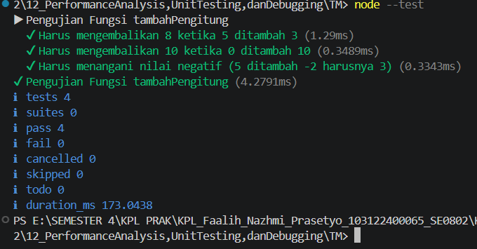

**Nama:** Faalih Nazhmi Prasetyo
**NIM:** 103122400065
**Kelas:** SE-08-02

## Soal
Tambah dan tambah!

Fungsi di bawah ini melakukan penjumlaha pada penghitung (counter), yang sesederhana menambahk jumlah jika kamu menekan tombol.

hitung.js
```
function tambahPengitung(terkini, jumlah) {
  terkini = terkini + jumlah;
  return terkini;
}
hitung.test.js

import { test } from 'node:test';
import assert from 'node:assert';
import { tambahPengitung } from './hitung.js';

test('5 tambah 3 sama dengan 8', () => {
  assert.strictEqual(tambahPengitung(5, 3), 8);
});

test('0 tambah 10 sama dengan 10', () => {
  assert.strictEqual(tambahPengitung(0, 10), 10);
});
```
Bisakah kamu tunjukkan apakah kode sudah benar atau bagian mana yang perlu diperbaiki beserta alasannya?

## Output


## Deskripsi
Meskipun berkas hitung.js dan hitung.test.js telah berjalan dengan baik serta seluruh pengujian berhasil dilewati, masih terdapat beberapa aspek pada hitung.js yang dapat ditingkatkan agar lebih sesuai dengan prinsip clean code dan efisiensi pemrograman.

1. Reassignment pada Parameter (terkini = terkini + jumlah)
Mengubah nilai parameter fungsi secara langsung merupakan praktik yang kurang disarankan. Pendekatan ini dapat menimbulkan side effect yang tidak diinginkan serta membuat alur program menjadi lebih sulit dipahami dan dipelihara, terutama ketika aplikasi berkembang menjadi lebih kompleks.

2. Implementasi yang Terlalu Panjang
Untuk operasi penjumlahan sederhana, tidak diperlukan proses penyimpanan ulang hasil ke variabel yang sama sebelum mengembalikannya. Langkah tersebut menambah baris kode tanpa memberikan manfaat yang signifikan.

Perbaikan yang Disarankan
Fungsi dapat disederhanakan dengan langsung mengembalikan hasil perhitungan menggunakan return terkini + jumlah;. Pendekatan ini membuat kode lebih ringkas, mudah dibaca, serta menghindari perubahan nilai parameter secara langsung.

```
///hitung.js yang sudah diperbaiki
export function tambahPengitung(terkini, jumlah) {
  return terkini + jumlah; 
}
```