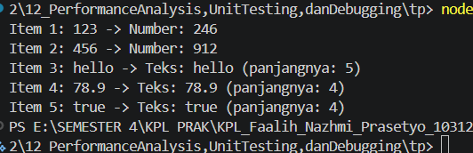

**Nama:** Rizqi Nawaf Putra Rosyadi

**NIM:** 103122430010

**Kelas:** SE-08-02

## Soal
Cobalah untuk menangkap kecacatan dalam kode ini

```
function main() {
  const data = [
    "123",
    456,
    "hello",
    78.9,
    true,
  ];

  for (let i = 0; i < data.length; i++) {
    const result = processData(data[i]);
    console.log(`Item ${i + 1}: ${data[i]} -> ${result}`);
  }
}

function processData(data) {
  const str = data.toLowerCase();
  const num = parseInt(str);
  if (!isNaN(num) && str === String(num)) {
    return `Number: ${num * 2}`;
  }
  return `Teks: ${str} (panjangnya: ${str.length})`;
}

main();
```

## Output


## Deskripsi
Error TypeError: data.toLowerCase is not defined terjadi pada iterasi kedua ketika fungsi processData() menerima nilai berupa angka (456) dan mencoba menjalankan metode .toLowerCase(). Metode tersebut hanya dapat digunakan pada objek bertipe String, sehingga pemanggilan terhadap tipe data numerik menyebabkan program mengalami kegagalan dan berhenti dieksekusi.

Kondisi ini menunjukkan pentingnya proses debugging dan penanganan edge case, terutama ketika aplikasi harus memproses data dengan tipe yang beragam (heterogeneous data). Akibat error tersebut, elemen berikutnya dalam daftar, seperti "hello", 78.9, dan true, tidak sempat diproses karena program sudah terhenti lebih dahulu.

Untuk mengatasi masalah ini, dapat diterapkan pendekatan defensive programming dengan melakukan konversi tipe data secara eksplisit menggunakan String(data).toLowerCase(). Dengan cara tersebut, setiap nilai masukan akan terlebih dahulu diubah menjadi teks sebelum diproses lebih lanjut. Solusi ini membuat fungsi lebih robust, mencegah terjadinya error akibat perbedaan tipe data, serta memastikan seluruh data dapat diproses hingga selesai dan menghasilkan keluaran yang valid.